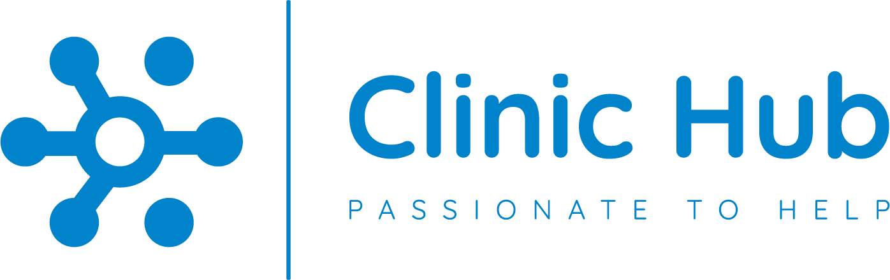

<h1 align="center" color="white"></h1>

<h2 align="center"><a color="white" href="https://clinichub.vercel.app/">Visitar aplicação</a></h2>

## Sobre
Esse projeto trata-se de um sistema para gerenciamento para pequenas clínicas, onde é possível gerenciar médicos, pacientes, equipamentos, financeiro, atendimentos entre outras funções. A API foi desenvolvido utilizando Node e Typescript com MongoDB para banco de dados em conjunto com práticas modernas e robustas de desenvolvimento de software.

## Objetivo
O objetivo do projeto foi construir um sistema utilizando as melhores práticas de desenvolvimento de software, criando um código limpo e de fácil manutenção. Para isso o intuito é cobrir o sistema com testes unitários e em conjunto com a arquitetura Clean Architecture separando as responsabilidades em camadas bem definidas para criar uma base sólida e escalável para o projeto.

## Principais features
- Sistema de autenticação completo com geração de token.
- Sistema de controle de acesso, limitando o acesso a rotas dependendo do funcionário.
- Criptografia de senha para aumentar a segurança contra roubo de dados.
- Aplicação da arquitetura Clean Architecture, para promover a separação de responsabilidades e a escalabilidade do projeto.
- Validação de dados utilizando a biblioteca [YUP](https://github.com/jquense/yup), garantindo a integridade dos dados processados.

## Aprendizados
Durante o desenvolvimento desse projeto, adquiri diversos aprendizados significativos. A construção do Back-end do zero em conjunto com a aplicação do Clean Architecture permitiu um desenvolvimento mais controlado, ajudando a manter uma separação clara de responsabilidades, facilitando a evolução e a manutenção do sistema. Além dos testes sendo criados com [Jest](https://jestjs.io/pt-BR/docs/getting-started), que resultou em um código mais confiável e testável.

## Tecnologias e ferramentas utilizadas
- [NodeJS](https://nodejs.org/en)
- [Express](https://expressjs.com/pt-br)
- [TypeScript](https://www.typescriptlang.org/)
- [Vitest](https://vitest.dev)
- [JWT](https://jwt.io/introduction)
- [Bcrypt](https://www.npmjs.com/package/bcrypt)
- [Tsx](https://www.npmjs.com/package/tsx)
- [MongoDB](https://www.mongodb.com)
- [Mongoose](https://mongoosejs.com)
- [YUP](https://github.com/jquense/yup)
- [TailwindCSS](https://tailwindcss.com/docs/guides/vite)
